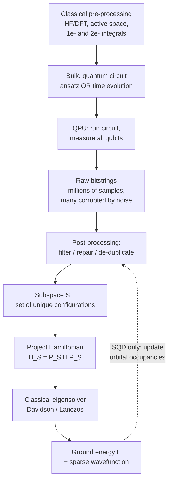
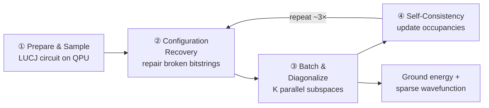
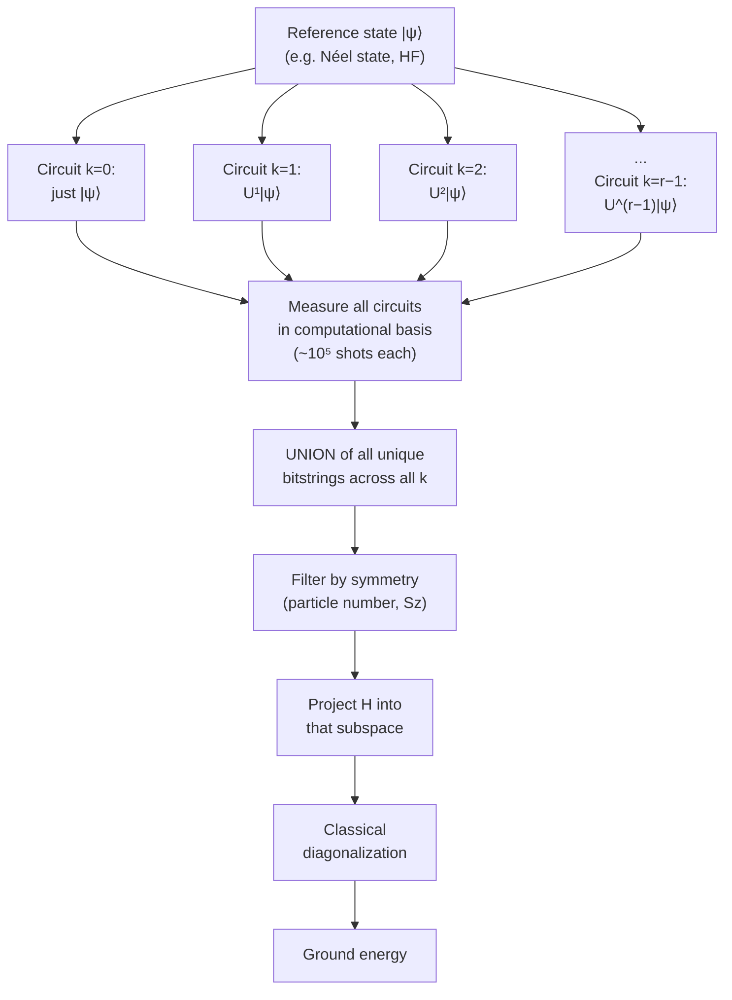
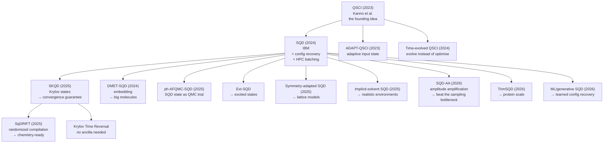

# Sample-Based Quantum Diagonalization (SQD) and Sample-Based Krylov Quantum Diagonalization (SKQD)

### A Research Analyst's Report — Method, Evidence, Criticism, and Outlook

**Prepared:** August 2026
**Scope:** Literature from Feb 2023 (the original QSCI paper) through Aug 2026
**Purpose:** A complete, presentation-ready briefing. Written to be read once and turned into slides.

---

## How to Read This Report

| If you have... | Read these sections |
|---|---|
| 5 minutes | §0 Executive Summary, §7 Comparison Table |
| 30 minutes | §0–§4 (the core method), §8 (the critique) |
| Building a talk | Everything, then §13 (slide skeleton) |
| Doing the research | §5, §6, §9, §12, and the Reference list |

**A note on tone:** I have deliberately avoided both hype and dismissal. SQD/SKQD is the most-run quantum chemistry algorithm on real hardware today *and* it has a serious, unresolved scaling objection in the literature. A good presentation says both things clearly.

---

## Table of Contents

0. [Executive Summary](#0-executive-summary)
1. [The Problem These Methods Solve](#1-the-problem-these-methods-solve)
2. [The Core Idea in Plain Language](#2-the-core-idea-in-plain-language)
3. [SQD — The Method in Detail](#3-sqd--the-method-in-detail)
4. [SKQD — The Method in Detail](#4-skqd--the-method-in-detail)
5. [The Family Tree: Variants and Extensions](#5-the-family-tree-variants-and-extensions)
6. [Landmark Experiments and Results](#6-landmark-experiments-and-results)
7. [SQD vs SKQD vs Alternatives — Head-to-Head](#7-sqd-vs-skqd-vs-alternatives--head-to-head)
8. [The Critique: What's Actually Wrong](#8-the-critique-whats-actually-wrong)
9. [Where It Stands Against Classical Methods](#9-where-it-stands-against-classical-methods)
10. [Software, Tooling, and How to Actually Run It](#10-software-tooling-and-how-to-actually-run-it)
11. [Open Problems](#11-open-problems)
12. [Outlook: 2026–2030](#12-outlook-20262030)
13. [Presentation Skeleton](#13-presentation-skeleton)
14. [Glossary](#14-glossary)
15. [References](#15-references)

---

## 0. Executive Summary

**The one-sentence version:** SQD and SKQD use a quantum computer *only as a sampler* — it suggests which electron arrangements matter — and then a classical supercomputer does the actual eigenvalue solve inside that small suggested subspace.

### The five things to know

**1. It sidesteps the two things that killed VQE.**
The Variational Quantum Eigensolver needed (a) a noisy classical optimization loop over quantum parameters and (b) enormous numbers of measurements to estimate energies. SQD needs neither. The quantum computer runs a *fixed* circuit and just measures. The energy is computed classically and exactly within the subspace, so it is a rigorous variational upper bound regardless of how noisy the quantum device was.

**2. It has produced by far the largest quantum chemistry demonstrations to date.**
77 qubits on iron–sulfur clusters with IBM Heron + Fugaku (2024–25) [R1]. Then 94 qubits on protein–ligand complexes of 12,635 atoms, using ~1.3 billion shots and ~369,000 Fugaku node-hours (2026) [R14]. Nothing else in quantum chemistry runs at this scale on real hardware.

**3. SKQD is SQD plus a convergence guarantee.**
Plain SQD's accuracy depends entirely on whether your guessed trial state happened to be good. SKQD instead samples from a *sequence* of time-evolved states (a Krylov sequence), which provably sweeps in the important configurations — under two assumptions: the starting state overlaps the ground state, and the ground state is sparse in the computational basis [R2]. Same assumption structure as Quantum Phase Estimation, but with far shallower circuits.

**4. There is a credible, unresolved attack on the whole approach.**
Reinholdt et al. [R7] showed that finding rare-but-important configurations by sampling is a *coupon-collector problem with a very skewed distribution*. Yield collapses: going from 10⁶ to 10⁹ samples on N₂ found only ~38× more new configurations. They estimate ~4×10¹⁴ samples for microhartree accuracy on a small molecule. Worse, at matched accuracy, classical Heat-Bath CI needed roughly an order of magnitude *fewer* configurations than the quantum-sampled subspace. A 2026 machine-learning survey [R11] independently concluded that "strong classical selected CI matches or beats the quantum-sampled subspace" across comparable experiments.

**5. The honest verdict: engineering triumph, advantage unproven.**
SQD/SKQD is the best-engineered NISQ-era chemistry workflow that exists, and is the leading candidate for IBM's stated end-of-2026 quantum advantage target. But as of Aug 2026, no published result shows it beating a well-tuned classical selected-CI or DMRG calculation on equal footing. The open question is not "does it work" — it does — but "does the quantum sampler ever propose a *better* subspace than a classical heuristic could."

### Quick verdict table

| Dimension | SQD | SKQD |
|---|---|---|
| Maturity | Production-grade, widely used | Research-grade, growing fast |
| Convergence guarantee | ❌ None | ✅ Yes (under assumptions) |
| Circuit depth needed | Low (one fixed ansatz) | Higher (Trotterized time evolution × k) |
| Best domain | Molecular chemistry | Lattice models, spin systems, gauge theories |
| Noise tolerance | Very high (recovery loop) | High (post-selection) |
| Largest hardware demo | 94 qubits (protein–ligand) [R14] | ~85 qubits (Anderson impurity) [R2] |
| Main weakness | No guarantee; sampling bottleneck | Circuit depth; subspace still grows exponentially |

---

## 1. The Problem These Methods Solve

### 1.1 Why electronic structure is hard

To predict how a molecule reacts, binds to a protein, or catalyses a reaction, you need its **electronic ground state** — the lowest-energy arrangement of its electrons.

The exact method is **Full Configuration Interaction (FCI)**. You write the wavefunction as a weighted sum over *every possible way* of placing N electrons into M orbitals:

```
|Ψ⟩ = Σ_x  c_x |x⟩
```

Each `|x⟩` is one **configuration** (also called a *Slater determinant*, or in qubit language simply a *bitstring* — 1 = orbital occupied, 0 = empty).

The trouble is the number of terms:

| Active space (electrons, orbitals) | Number of configurations | Comment |
|---|---|---|
| (10e, 10o) | ~63,504 | Laptop |
| (10e, 26o) — N₂ / cc-pVDZ | 4.32 × 10⁹ | Cluster [R1] |
| (30e, 20o) — [2Fe-2S] | 2.40 × 10⁸ | Cluster [R1] |
| (54e, 36o) — [4Fe-4S] | 8.86 × 10¹⁵ | **Beyond exact diagonalization** [R1] |
| (60e, 60o) | ~10³⁶ | Beyond any classical machine, ever |

This is *the* exponential wall. Storing 10¹⁵ complex numbers is already impossible; 10³⁶ is not a hardware problem, it is a physics problem.

### 1.2 What classical chemistry does about it

Classical quantum chemistry has excellent workarounds, and **these are the real competition** — not brute-force FCI.

| Method | Idea | Strength | Weakness |
|---|---|---|---|
| **CCSD(T)** | Perturbative "gold standard" | Cheap, very accurate | Breaks down under *strong correlation* (bond breaking, transition metals) |
| **DMRG** | Compress the wavefunction as a tensor network | Excellent for 1D-like systems | Cost explodes for 2D/3D and long-range coupling |
| **SHCI / HCI** (Heat-Bath CI) | Classically *select* only the important configurations, iteratively | Very compact, very fast | Heuristic selection; struggles when no small subset dominates |
| **AFQMC** | Stochastic imaginary-time projection | Scales well | Sign problem; needs a good trial wavefunction |

The key insight: **HCI/SHCI already does exactly what SQD does — pick a small important subspace and diagonalize it.** The *only* difference is who picks the subspace: a classical heuristic, or a quantum computer. This framing is essential and belongs on a slide, because it is the axis on which the entire quantum-advantage argument turns.

### 1.3 Why VQE stalled

The Variational Quantum Eigensolver was the standard NISQ chemistry proposal (2014–2022). It failed to scale for four reasons:

```
VQE's four failure modes
├── Measurement cost   → millions of circuit runs to estimate one energy
├── Barren plateaus    → gradients vanish exponentially with qubit count
├── Noise breaks it    → the variational bound is no longer valid under noise
└── Optimization loop  → thousands of noisy quantum evaluations per step
```

SQD's design is best read as **a direct answer to each of these**. That is why it caught on so quickly.

---

## 2. The Core Idea in Plain Language

### 2.1 The division of labour

> **The quantum computer's job is not to compute the answer. Its job is to write a shortlist.**

Think of the full Hilbert space as a library of 10¹⁵ books. You cannot read them all. You need someone to hand you the ten million books that actually matter. Then you read *those* carefully, yourself, on a classical supercomputer.

- **Quantum computer** = the librarian who knows which shelves matter. It holds an entangled superposition and, when measured, emits configurations *with probability proportional to their importance*: `P(x) = |⟨x|Ψ⟩|²`.
- **Classical supercomputer** = the reader who does the exact linear algebra.

### 2.2 Why this is noise-robust — the crucial point

This is the single most important conceptual point in the field, and it is often explained badly.

When the quantum computer is noisy, the samples it produces are *wrong* — but wrong in a very forgiving way. Samples are only ever used **as a list of addresses**, never as numerical values.

```
Noisy quantum sample  →  "configuration #8,472,193 might be important"
                          ↑
                     This is either a good guess or a bad guess.
                     It is never a *wrong number*.
```

The energy is then computed **classically and exactly** inside the chosen subspace. Because it is a genuine Rayleigh–Ritz variational calculation:

```
E_SQD  ≥  E_exact      always
```

Noise can only make the subspace *worse* (higher energy). It can never make the answer wrong in an uncontrolled direction, and it can never break the variational bound. **Noise degrades quality, not validity.** Compare VQE, where noise corrupts the estimated energy itself and destroys the bound.

### 2.3 The generic pipeline



**SQD and SKQD differ in only one box** — box B, how you build the circuit that gets sampled. Everything downstream is shared. Say this explicitly in a presentation; it makes both methods easy to hold in mind at once.

| | SQD | SKQD |
|---|---|---|
| **Box B** | One fixed chemistry-inspired ansatz (e.g. LUCJ) | A *sequence* of time-evolution circuits `U^k = e^{-iHkΔt}` |
| Circuits run | 1 | r (the Krylov dimension, e.g. 5–15) |
| Sample source | Trial state | Union of samples from all Krylov states |

### 2.4 Naming: SQD vs QSCI

You will meet two names for essentially the same thing. Do not let this confuse you.

| Name | Origin | Emphasis |
|---|---|---|
| **QSCI** — Quantum-Selected Configuration Interaction | Kanno et al., QunaSys, Feb 2023 [R6] | Chemistry framing; sibling of classical selected-CI |
| **SQD** — Sample-based Quantum Diagonalization | Robledo-Moreno et al., IBM, May 2024 [R1] | General-operator framing; adds configuration recovery + HPC scale-out |

**The relationship:** QSCI came first and defined the concept. SQD is IBM's version; its distinctive technical contributions are **self-consistent configuration recovery** (noise repair) and **batched distributed diagonalization** (HPC scale). In current literature the terms are near-interchangeable; the 2026 ML survey [R11] states outright that SQD is "equivalently quantum-selected configuration interaction."

---

## 3. SQD — The Method in Detail

### 3.1 The four stages



---

### Stage ① — Prepare and sample the trial state

You need a quantum state that overlaps well with the true ground state. The workhorse is the **LUCJ ansatz** (Local Unitary Cluster Jastrow):

```
|Ψ⟩ = e^(−K̂₂) · e^(K̂₁) · e^(iĴ₁) · e^(−K̂₁) · |x_RHF⟩
```

Reading it right to left:

| Piece | What it is | Cost on hardware |
|---|---|---|
| `\|x_RHF⟩` | The Hartree–Fock reference — the simplest guess, one bitstring | Free (X gates) |
| `K̂_μ` | **Orbital rotations** (one-body). Mixes orbitals together. | Linear depth, `O(N_σ(N_MO − N_σ))` two-qubit gates |
| `Ĵ_μ` | **Jastrow / density–density** terms. Adds electron–electron correlation. | Constant depth, `O(N_MO)` ZZ rotations |

The **"L" (Local)** in LUCJ is the key hardware trick: the full UCJ ansatz needs density–density terms between *all* orbital pairs, which requires all-to-all qubit connectivity. LUCJ simply **zeroes out the terms between non-adjacent qubits**, so the circuit maps onto IBM's fixed heavy-hex lattice with no SWAP overhead. You lose some expressivity and buy an enormous amount of depth.

**Where do the parameters come from?** In the flagship experiments, they are **not variationally optimized** — they are taken directly from classical **CCSD amplitudes**. This is deliberate: it removes the optimization loop entirely, so there is no barren-plateau problem and no noisy feedback loop. The quantum computer runs exactly one circuit design, many times.

You then measure all qubits, typically **10³–10⁵ shots** per circuit (see §3.5 for why more is not better).

---

### Stage ② — Self-consistent configuration recovery (S-CORE)

**This is IBM's signature contribution, and the thing most worth explaining well.**

**The problem.** A valid chemistry configuration must have exactly N electrons — the bitstring must have exactly the right number of 1s in the spin-up half and the spin-down half. Noise flips bits. A flipped bit means an electron was created or destroyed. That configuration is now physically meaningless.

At realistic error rates on a 77-qubit circuit, *most* samples are broken.

**The naive fix** is to throw broken samples away. That works, but it wastes almost everything.

**The clever fix** is to *repair* them. Here is the logic:

```
1. From the current best wavefunction, compute average orbital occupancies:
       n_pσ  =  ⟨ n̂_pσ ⟩         (a number between 0 and 1 for each orbital)

2. Take a broken bitstring x with the wrong electron count.

3. For each bit, ask: "how surprising is this bit, given n_pσ?"
       A 0 sitting where n_pσ ≈ 1  →  very suspicious, probably a noise flip
       A 1 sitting where n_pσ ≈ 0  →  very suspicious, probably a noise flip

4. Flip bits probabilistically, weighted by that surprise
   (weight ∝ |x_pσ − n_pσ|, passed through a modified ReLU),
   until the electron count is correct again.

5. Keep the repaired configuration.
```

**Why "self-consistent"?** The occupancies `n_pσ` are themselves computed *from the SQD result*. So it is a loop: sample → repair using current `n` → diagonalize → get better `n` → repair better → ... In practice this **converges in ≤ 3 iterations** [R1].

**How much does it buy you?** The headline number from the original paper, on N₂/6-31G [R1]:

| | Fraction of clean signal needed to reach 10 mHa error |
|---|---|
| Without configuration recovery | ~20% |
| **With configuration recovery** | **~2%** |

That is a **10× relaxation of the hardware fidelity requirement**. It is the reason SQD ran on 2024-era hardware at all.

> **Presentation tip:** This is your best "aha" slide. Analogy: it is like a spell-checker that fixes a garbled word using the rest of the sentence as context — except the "context" is the current best guess at the molecule's electron distribution, and it improves every round.

**An important caveat.** Configuration recovery works because particle number is a *hard, known symmetry* of chemistry Hamiltonians. A 2026 paper [R20] points out that for many other eigenvalue problems no such constraint exists, which limits where SQD-style recovery can be transplanted. Extensions using error-correcting-code-style "code space" recovery are being developed for exactly this reason.

---

### Stage ③ — Batching and distributed diagonalization

You now have a large pool of valid configurations — potentially far more than you can diagonalize at once.

The trick is to **not** diagonalize one giant subspace. Instead:

1. Draw **K batches** (typically K = 100), each a random subset of dimension `d`.
2. Project the Hamiltonian into each batch: `Ĥ_S⁽ᵏ⁾ = P̂_S⁽ᵏ⁾ Ĥ P̂_S⁽ᵏ⁾`.
3. Diagonalize all K of them **in parallel** on separate compute nodes (Davidson method).
4. Take the **lowest** energy `E⁽ᵏ⁾` as your answer; use its eigenvector to update the occupancies.

**Why batching is smart:**

| Benefit | Explanation |
|---|---|
| Embarrassingly parallel | K independent problems → perfect for a supercomputer |
| Statistical robustness | 100 tries at picking a good subspace, not 1 |
| Bounded memory | Each node only holds a manageable subspace |
| Variational safety | Every batch gives a valid upper bound; the minimum is still valid |

In the [4Fe-4S] experiment, this ran across **6,400 Fugaku nodes**, with roughly 1.5 hours of classical runtime per diagonalization at 64 nodes [R1].

**Spin-symmetry restoration.** Slater determinants are not eigenstates of total spin Ŝ². SQD handles this two ways [R1]: (a) build each batch as a tensor product of all unique spin-up × spin-down strings, which makes the subspace closed under spin operations; and (b) add a penalty `λ[Ŝ² − s(s+1)]²` to the solver (λ ≈ 0.2).

---

### Stage ④ — Iterate to self-consistency

Compute updated occupancies by averaging over batches:

```
n_pσ  =  (1/K) Σ_k ⟨ψ⁽ᵏ⁾| n̂_pσ |ψ⁽ᵏ⁾⟩
```

Feed back into Stage ②. Stop when the energy stops dropping — usually 3–5 rounds.

---

### 3.2 The complete SQD algorithm, compactly

```
INPUT:  Hamiltonian H, electron count N, orbital count M, shot budget
        d (batch dimension), K (number of batches)

1.  Classical:  run HF/CCSD → build LUCJ circuit from CCSD amplitudes
2.  Quantum:    execute circuit, measure → raw bitstring set X̃
3.  Initialize occupancies n from Hartree–Fock
4.  REPEAT until converged:
5.      X ← configuration_recovery(X̃, n)          # repair broken strings
6.      FOR k = 1..K IN PARALLEL:
7.          S⁽ᵏ⁾ ← sample d configurations from X
8.          E⁽ᵏ⁾, ψ⁽ᵏ⁾ ← eigensolve(P_S⁽ᵏ⁾ H P_S⁽ᵏ⁾)
9.      E ← min_k E⁽ᵏ⁾
10.     n ← (1/K) Σ_k ⟨ψ⁽ᵏ⁾| n̂ |ψ⁽ᵏ⁾⟩
11. RETURN E, ψ
```

### 3.3 Complexity — where the cost actually lives

| Resource | Scaling | Comment |
|---|---|---|
| Quantum circuit depth | `O(M)` for LUCJ | Very shallow — the whole point |
| Quantum shots | **The bottleneck** — see §8 | Empirically 10³–10⁵ per circuit works; theory says it can blow up |
| Classical diagonalization | `O(d × n_nonzero)` per Davidson iteration | Dominates wall-clock at scale |
| Classical memory | `O(d)` per node | Why batching exists |
| Recovery loop | Polynomial in `d` and `K` | Cheap, not a bottleneck [R1] |

**The often-missed point:** at these scales, SQD is *classically* expensive. The [4Fe-4S] run used a top-10 supercomputer. The quantum part was minutes; the classical part was thousands of node-hours. This is why the field calls it **quantum-centric supercomputing** rather than "quantum computing."

### 3.4 What SQD gives you beyond the energy

- **A sparse wavefunction** — an explicit list of configurations and coefficients. This is genuinely valuable: it can be fed to other classical methods (see AFQMC coupling, §5).
- **Reduced density matrices** — from which you get dipole moments, forces, orbital occupations, spin densities.
- **Energy–variance pairs** — plotting E against ⟨H²⟩−⟨H⟩² lets you extrapolate toward the exact answer and diagnose whether you are converging on the right eigenstate [R1].

### 3.5 The counter-intuitive shot-budget result

A 2026 robustness study on IBM Heron-r2 (`ibm_fez`, 156 qubits) swept shot counts from 10² to 10⁵ on BeH₂, H₂O, and N₂ [R10]:

| Shots | Outcome |
|---|---|
| 10² | Too few — poor subspace |
| **10³ – 10⁴** | **Performance saturates. Sweet spot.** |
| 10⁵ | Plateaus at *slightly worse* energies |

More shots being worse is surprising. The explanation: the recovery loop uses a **fixed working-set size**, so a flood of extra low-probability strings dilutes the pool rather than enriching it. **Practical takeaway: budget ~10,000 shots, then spend your money on better circuits or more recovery iterations instead.**

The same study found other useful engineering facts:

- **CCSD input quality barely matters.** Sign-flipping the t₂ amplitudes, scaling HOMO terms by 2π, or *zeroing them entirely* changed the converged error by **under 7 mHa**. The recovery loop absorbs bad classical input within a few iterations.
- **Qubit layout matters at the start, not at the end.** A 40× error spread between layouts at iteration 1 narrowed to within 1.4× by iteration 4. A "zigzag" layout gave the cleanest start.
- **Error mitigation (dynamical decoupling, Pauli twirling) gives only modest benefit** once the recovery loop has converged.

This is a strong self-healing story and worth a slide: **SQD is remarkably forgiving of bad inputs.**

---

## 4. SKQD — The Method in Detail

### 4.1 Why SKQD exists

SQD has a philosophical hole: **it has no convergence guarantee.** If your LUCJ ansatz happens to miss an important configuration, nothing in the algorithm will ever find it. You will get a converged, self-consistent, confidently *wrong* answer.

SKQD closes that hole by borrowing the mathematics of **Krylov subspaces**.

### 4.2 The Krylov idea in one picture

A Krylov space is what you get by repeatedly hitting a starting vector with an operator:

```
K^r  =  span{ |v⟩, A|v⟩, A²|v⟩, ..., A^(r−1)|v⟩ }
```

This is the mathematical engine behind the Lanczos and Arnoldi algorithms — the workhorses of classical numerical linear algebra. The magic is that this sequence **converges to the extremal eigenvectors extremely fast**, typically in far fewer steps than the matrix dimension.

**The obstacle:** you cannot build `H|v⟩, H²|v⟩, ...` on a quantum computer, because **H is not unitary** and quantum circuits only implement unitaries.

**The fix:** use the *time-evolution* operator instead, which is unitary and encodes the same spectral information:

```
U = e^(−iHΔt)

K_U^r  =  span{ |ψ⟩, U|ψ⟩, U²|ψ⟩, ..., U^(r−1)|ψ⟩ }
```

Sampling `U^k|ψ⟩` for `k = 0, 1, 2, ..., r−1` gives what is called a **unitary Krylov space**, and it carries essentially the same convergence guarantees as the power Krylov space [R21].

### 4.3 The SKQD algorithm



**The three ingredients you must choose** [R21]:

| Ingredient | What it is | How to pick it |
|---|---|---|
| **Krylov dimension `r`** | How many time steps | Increase until energy stops dropping. Typical: 5–15 |
| **Time step `Δt`** | Evolution per step | Theory says `Δt = π/‖H‖` suffices. In practice, optimal choice is *still an open research question* |
| **Reference state `\|ψ⟩`** | Starting point | Must have **polynomial overlap** with the ground state. Néel state for antiferromagnets; HF for molecules |

**Implementation:** `U^k` is realised with **Trotterization** (e.g. Lie–Trotter synthesis). More Trotter steps = more accuracy = deeper circuit. This trade-off is SKQD's central engineering tension.

**Crucially — the union step.** You do not sample one state; you pool the unique bitstrings from *all* r circuits. Early circuits contribute the dominant configurations; later, more-evolved circuits contribute the rare ones that the ansatz alone would never have found. **This is exactly the mechanism that gives SKQD its guarantee.**

### 4.4 The convergence theorem — what it actually says

Informally [R2]:

> **Under two assumptions — (1) the reference state has non-negligible (inverse-polynomial) overlap with the ground state, and (2) the ground state is *sparse* / concentrated on a polynomial number of computational basis states — SKQD converges to the ground state in polynomial time.**

Unpack this carefully, because presentations routinely overstate it:

| Assumption | Plain meaning | Is it reasonable? |
|---|---|---|
| **Overlap** | Your starting guess isn't orthogonal to the answer | Same assumption QPE makes. Generally accepted for chemistry; can fail for strongly correlated systems |
| **Sparsity** | A polynomial number of configurations carries essentially all the weight | **This is the contested one.** True for many molecules. *Provably false* for Heisenberg and Hubbard ground states [R9] |

So SKQD's guarantee is real, but it is conditional on a property of the *problem*, not of the algorithm. When sparsity fails, the guarantee is vacuous — and §8 shows exactly where it fails.

### 4.5 SKQD vs KQD — why sampling wins

Standard **Krylov Quantum Diagonalization (KQD)** builds the same subspace but computes the matrix elements `H_ij = ⟨ψ_i|H|ψ_j⟩` and overlaps `S_ij = ⟨ψ_i|ψ_j⟩` directly on hardware, via **Hadamard tests**. That means:

- an extra ancilla qubit,
- controlled versions of the time-evolution unitary (much more expensive),
- one measurement campaign per matrix element — `O(r²)` of them,
- and matrix elements are *numbers*, so hardware noise corrupts them directly.

SKQD replaces all of that with plain computational-basis sampling. IBM's own summary is blunt: **"SKQD requires much less QPU time, because it avoids the costly calculation of matrix elements via the Hadamard test"** [R21]. And you regain the noise-robustness argument of §2.2 — samples are addresses, not values.

| | KQD | SKQD |
|---|---|---|
| Matrix elements | Measured on QPU (Hadamard test) | Computed classically |
| Ancilla + controlled-U | Required | Not required |
| Measurement campaigns | `O(r²)` | `r` (one per Krylov state) |
| Noise in matrix elements | Direct corruption | None — computed exactly |
| Ill-conditioned overlap matrix | Serious problem | Avoided (orthonormal basis by construction) |

### 4.6 SqDRIFT — the randomized variant that made SKQD work for chemistry

SKQD's weakness is depth. Trotterizing a *molecular* Hamiltonian — with `O(M⁴)` terms and long-range interactions — produces circuits far too deep for current hardware.

**SqDRIFT** [R3] replaces deterministic Trotterization with **qDRIFT-style randomized compilation**: instead of applying every Hamiltonian term in sequence, you randomly sample terms with probability proportional to their coefficient magnitude, and apply only those. The result is a stochastic circuit whose *average* reproduces the correct evolution.

| Property | Trotter SKQD | SqDRIFT |
|---|---|---|
| Circuit depth | Scales with number of H terms | Scales with `‖H‖₁²/ε`, independent of term count |
| Hardware connectivity | Needs SWAP networks for long-range terms | Naturally handles long-range terms |
| Convergence guarantee | Yes | **Preserved** |
| Best for | Lattice models | **Molecular chemistry** |

Qiskit's documentation makes the distinction sharp: SqDRIFT "ensures the time-evolution circuits can still be implemented efficiently on hardware with limited qubit connectivity, even when the Hamiltonian is not that of a regular fermionic lattice but contains long-range connections and more than quadratic interaction terms."

**Result:** SqDRIFT computed ground-state energies of **polycyclic aromatic hydrocarbons**, including **coronene in cc-pVDZ**, in active spaces up to **48 qubits**, at sizes beyond exact diagonalization [R3]. This is the paper that made SKQD chemically relevant rather than a lattice-model curiosity.

### 4.7 SKQD in practice — a concrete parameter set

From NVIDIA's CUDA-Q reference implementation on a 22-qubit 1D Heisenberg chain [R23]:

| Parameter | Value |
|---|---|
| System | 22-qubit Heisenberg chain, `J_x = J_y = J_z = 1.0` |
| Reference energy (exact) | −38.272304 |
| Shots per Krylov state | 100,000 |
| Total evolution time | π |
| Trotter steps | 8 |
| Max Krylov dimension | 12 |
| Classical solver | GPU-accelerated sparse CSR, or matrix-free Lanczos with multi-GPU NCCL |

Note the shot count — **100,000 per circuit**, an order of magnitude above SQD's sweet spot. SKQD is hungrier, because it must discover rare configurations rather than merely repair damaged ones.

---

## 5. The Family Tree: Variants and Extensions

The field has exploded since 2023. Here is the landscape organised by *what problem each variant solves*.



### 5.1 Variants that fix the *sampling* problem

| Variant | Core idea | Claimed result |
|---|---|---|
| **SQD-AA** — amplitude amplification [R12] | Use amplitude amplification to *suppress already-seen bitstrings*, making new ones more likely | >100× reduction in total query complexity; provable quadratic advantage for exponentially decaying distributions; circuits 3–4 orders of magnitude shallower than iterative QPE; ~2 orders of magnitude faster wall-clock than plain SQD |
| **Time-evolved QSCI** [R17] | Sample from stochastically time-evolved states rather than an optimized ansatz | On SiH₄ (42 qubits, IQM 54-qubit device): 5.6×10⁴ configurations vs 2.5×10⁷ for conventional selection — >200× more compact [R8] |
| **Generative / ML configuration recovery** [R11] | Train a neural or generative model on measured configurations to *propose* new ones | Framework and taxonomy established; verdict on advantage still negative |
| **Cluster-adaptive SQD** [R22] | Adapt the sampled subspace to cluster structure in strongly correlated systems | Improved convergence for strongly correlated systems |

### 5.2 Variants that fix the *system size* problem

| Variant | Core idea | Demonstrated scale |
|---|---|---|
| **DMET-SQD** [R5] | Density Matrix Embedding: split the molecule into fragments, treat each fragment's active region with SQD | H₁₈ ring and cyclohexane conformers; 41- and 89-qubit *full molecules* decomposed into 27- and 32-qubit *active regions* on `ibm_cleveland` |
| **EWF + SQD** [R13] | Embedded-wavefunction fragmentation; every atom explicitly in the CI treatment | 300-atom Trp-cage miniprotein, two conformers |
| **TrimSQD** [R14] | Trim determinants based on diagonalization results before the next round | 12,635-atom trypsin–benzamidine complex, 31,795 orbitals, 94 qubits |
| **Many-body expansion / fragment SQD** | Decompose into fragments; SQD the hard ones, FCI the easy ones | Linear alkanes; protein–ligand complexes |

### 5.3 Variants that extend *what you can compute*

| Variant | Adds |
|---|---|
| **Ext-SQD** | **Excited states** — augments the sampled subspace by applying explicit excitation operators (singles, doubles, triples) to already-found configurations |
| **SQD with orbital optimization (SQD-OO)** | Rotates the orbital basis to make the wavefunction more compact — available in `qiskit-addon-sqd` |
| **Symmetry-adapted SQD** [R18] | Embeds space-group symmetry into the subspace; closes the sample set under the symmetry group. Improves convergence in the momentum basis for both spin-quintet ground and spin-singlet excited states of lattice models |
| **Implicit-solvent SQD (SQD + IEF-PCM)** [R15][R16] | Puts the molecule in a **dielectric environment** — i.e. in solution, which is where actual chemistry happens. Solvation energies within 0.1 kcal/mol of classical CASCI/PCM |
| **Periodic SQD** [R19] | **Band gaps of crystalline solids** — within ~50 meV of reference methods |
| **ph-AFQMC-SQD** [R4] | Uses the SQD wavefunction as a **trial state for auxiliary-field QMC**. No tomography needed, since SQD already outputs an explicit determinant expansion |

**The AFQMC coupling deserves special mention** as the most interesting "SQD as a component, not a solution" idea. Results [R4]:

| System | Result |
|---|---|
| N₂ dissociation (10e, 26o) | ph-AFQMC-SQD recovered an *additional* 80–200 mHa of correlation energy beyond SQD alone; average error 2.5 mHa vs exact |
| [2Fe-2S] (30e, 20o) | Extrapolated energies within 0.6–13 mHa of DMRG benchmarks |

The lesson: **SQD's output is a compact, tomography-free trial wavefunction, and that has value even if SQD's own energy isn't state-of-the-art.**

---

## 6. Landmark Experiments and Results

### 6.1 The headline demonstrations

| Year | Study | Method | System | Qubits | Hardware | Classical | Key result |
|---|---|---|---|---|---|---|---|
| 2023 | Kanno et al. [R6] | QSCI | Small molecules | ~10s | Simulator + hardware | Laptop | Founding demonstration of the concept |
| 2024–25 | Robledo-Moreno et al. [R1] | **SQD** | N₂ (10e,26o) | **58** | IBM Heron | Fugaku | Matched CCSD until dissociation |
| 2024–25 | Robledo-Moreno et al. [R1] | **SQD** | [2Fe-2S] (30e,20o) | **45** | IBM Heron | Fugaku | Subspace quality comparable to HCI |
| 2024–25 | Robledo-Moreno et al. [R1] | **SQD** | [4Fe-4S] (54e,36o) | **77** | IBM Heron, ~3,500 2q gates | **6,400 Fugaku nodes** | Hilbert space 8.86×10¹⁵ — **beyond exact diagonalization** |
| 2025 | Kaliakin et al. [R5] | DMET-SQD | Cyclohexane conformers | 89 → 32 active | `ibm_cleveland` | — | Conformer energies agree with classical reference |
| 2025 | Yu et al. [R2] | **SKQD** | Single-impurity Anderson, 41 bath sites | **~85** | IBM Heron | Frontier | Excellent agreement with DMRG |
| 2025 | Piccinelli et al. [R3] | **SqDRIFT** | Coronene / PAHs, cc-pVDZ | up to **48** | — | — | Beyond exact diagonalization with shallow circuits |
| 2025 | Rosanowski et al. [R24] | **SKQD** | Schwinger model + θ-term | 4–30 | Trapped-ion **and** `ibm_marrakesh`/`ibm_kingston` | — | Reconstructed first-order phase transition; up to 80% Hilbert-space reduction |
| 2025 | Duriez et al. [R19] | SQD | Periodic solids | ~50 | IBM | — | Band gaps within ~50 meV |
| 2026 | Firt et al. [R25] | **SKQD** | Heisenberg chains | 18, 30 | IBM | — | Magnetization curves match theory |
| 2026 | Cleveland Clinic / RIKEN / IBM [R14] | **TrimSQD** | Trypsin–benzamidine, **12,635 atoms** | **94** | `ibm_cleveland` + `ibm_kobe` | Fugaku + Miyabi-G | Largest HQC chemistry calculation to date |

### 6.2 The flagship experiment, in numbers

**[4Fe-4S] cluster (Robledo-Moreno et al., *Science Advances*, 2025) [R1]**

| Quantity | Value |
|---|---|
| Active space | 54 electrons, 36 orbitals |
| Qubits | 77 |
| Two-qubit gates | ~3,500 |
| Full Hilbert space | 8.86 × 10¹⁵ configurations |
| QPU | IBM Heron (133-qubit chip, 77 used) |
| 2-qubit gate fidelity | 99.77% |
| 1-qubit gate fidelity | 99.97% |
| Readout fidelity | 98.37% |
| T₁ / T₂ | 180 μs / 150 μs |
| Batches K | 100 |
| Classical resource | up to 6,400 Fugaku nodes |
| Runtime | ~1.5 h per diagonalization at 64 nodes |
| Recovery iterations to convergence | ≤ 3 |

**The honest reading of this result:** despite ~3,500 gates producing heavy error accumulation, the quantum-derived energy–variance pairs were **substantially lower than those from uniformly random configurations**. That is the paper's actual claim — the quantum signal survived, and beat random guessing. It is **not** a claim of beating classical chemistry.

### 6.3 The protein milestone, in numbers

**Trypsin–benzamidine complex (Cleveland Clinic / RIKEN / IBM, 2026) [R14]**

| Quantity | Value |
|---|---|
| Atoms | 12,635 |
| Orbitals | 31,795 |
| Method | EWF fragmentation + **TrimSQD** for hard fragments, CCSD/FCI for easy ones |
| Qubits | up to 94 |
| QPUs | `ibm_cleveland` and `ibm_kobe` (156-qubit Heron) |
| Circuits executed | 9,200 |
| QPU time | 100+ hours |
| Measurement outcomes collected | **1.3 billion** |
| Median 2q gate error | 0.18–0.22% |
| Fugaku consumption | ~369,000 node-hours, 72.5% parallel efficiency at full scale |
| Miyabi-G (H100 GPUs) | ~4,281 GPU-hours, 98.6% node utilization |
| Accuracy of fragment energies | as low as **0.1 mHa** vs CCSD |
| Claimed improvement | **>40× system size, 210× accuracy** vs prior 303-atom benchmark |

**Caveat stated by the authors themselves:** binding energy predictions remained "too positive," attributed to minimal basis-set limitations. **The calculation is a scale record, not a chemistry-accuracy record** — a distinction worth being precise about in any presentation.

---

## 7. SQD vs SKQD vs Alternatives — Head-to-Head

### 7.1 SQD vs SKQD

| Aspect | **SQD** | **SKQD** |
|---|---|---|
| **Where samples come from** | One fixed ansatz state (LUCJ) | r time-evolved Krylov states, pooled |
| **Circuits per run** | 1 | r (typically 5–15) |
| **Circuit depth** | Shallow — a few thousand 2q gates | Deeper — grows with r × Trotter steps |
| **Shots needed** | ~10³–10⁴ (saturates) [R10] | ~10⁵ per Krylov state [R23] |
| **Convergence guarantee** | None | Yes, under overlap + sparsity |
| **Noise handling** | Active repair (configuration recovery) | Passive post-selection |
| **Needs a good ansatz?** | **Yes — critical** | No — only a reference state with decent overlap |
| **Needs to know Δt?** | N/A | Yes, and optimal choice is unsolved |
| **Natural domain** | Molecular chemistry (well-defined orbitals) | Lattice models, spin systems, gauge theories |
| **Systematic improvement knob** | More shots, more recovery rounds | **Increase r** — clean, principled |
| **Chemistry-ready?** | Yes, out of the box | Only via SqDRIFT randomization |
| **Failure mode** | Silently converges to a wrong answer if ansatz is poor | Circuit too deep to run; or subspace grows too fast |

### 7.2 When to reach for which

```
Choosing between SQD and SKQD
│
├── Is your problem a MOLECULE with a good HF/CCSD starting point?
│   └── YES → SQD with LUCJ. Cheapest, most mature.
│       └── Does it fail to converge / do you distrust the ansatz?
│           └── YES → SqDRIFT (SKQD for chemistry)
│
├── Is your problem a LATTICE MODEL / SPIN SYSTEM / GAUGE THEORY?
│   └── YES → SKQD with Trotterized evolution. Natural fit.
│
├── Do you need a CONVERGENCE GUARANTEE for a publication claim?
│   └── YES → SKQD. SQD cannot give you one.
│
└── Is your hardware very depth-limited?
    └── YES → SQD. SKQD's Krylov circuits will not fit.
```

### 7.3 Against the wider algorithm landscape

| Algorithm | Circuit depth | Guarantee | Noise tolerance | Measurement cost | Status |
|---|---|---|---|---|---|
| **VQE** | Moderate | None | ❌ Poor — noise breaks the bound | Very high | Largely superseded |
| **QPE** | **Enormous** | ✅ Strong | ❌ Needs fault tolerance | Low | Fault-tolerant era only |
| **KQD** | High | ✅ Yes | Moderate — noisy matrix elements | High (`O(r²)` campaigns) | Research |
| **SQD** | **Low** | ❌ None | ✅ **Excellent** | Moderate | **Production** |
| **SKQD** | Moderate–High | ✅ Yes (conditional) | ✅ Good | High | Growing fast |
| **SQD-AA** | Moderate | Partial | Good | ✅ **Much lower** | New (2026) |

**The narrative arc for a slide:** VQE was too fragile → QPE is too deep → SQD is shallow and robust but unguaranteed → SKQD adds the guarantee at the cost of depth → SqDRIFT and SQD-AA are the current attempts to get both at once.

---

## 8. The Critique: What's Actually Wrong

**This section is essential.** A presentation that only shows the successes will not survive an informed question. The criticisms are specific, numerical, and published in strong venues.

### 8.1 The coupon-collector problem

**The single most important criticism**, from Reinholdt, Kaliakin et al. (*JCTC* 2025, arXiv:2501.07231) [R7], provocatively titled *"Exposing a Fatal Flaw in Sample-based Quantum Diagonalization Methods."*

**The setup.** To find all important configurations, you sample from `P(x) = |c_x|²`. But chemistry wavefunctions are **extremely skewed** — the Hartree–Fock configuration might carry 90% of the weight, and the configurations you actually need for the last few millihartree carry 10⁻⁸ each.

This is the **coupon-collector problem with wildly non-uniform probabilities**. To collect the rare coupon, you must draw roughly `1/p` times — and `p` is astronomically small.

**The numbers on N₂ (cc-pVDZ, 10e/22o) [R7]:**

| Samples drawn | New determinants found per sample (DPS) |
|---|---|
| 10³ | ~0.1 |
| 10⁹ | **0.0005** |

Going from 10⁶ to 10⁹ samples — **a 1000× increase in quantum runtime** — yielded only **38× more determinants**.

**The extrapolation:** reaching microhartree precision on N₂ would need roughly **4 × 10¹⁴ samples**. At a few milliseconds per shot, that is on the order of **10⁴ years of QPU time** for one small molecule.

```
Diminishing returns of sampling (schematic, N₂/cc-pVDZ)

new determinants
found per sample
   0.1 ┤●
       │ ╲
       │  ╲
  0.01 ┤   ●╲
       │      ╲
       │        ●─╲
 0.001 ┤            ╲──●───
       │                    ────●─────  0.0005
       └──┬────┬────┬────┬────┬────┬──
         10³  10⁴  10⁵  10⁶  10⁷  10⁹   samples
```

### 8.2 The compactness trade-off

You might think: "fine, just flatten the distribution — sample from `|c_x|^α` with `α < 1` so rare configurations appear more often."

Reinholdt et al. tested exactly this, and found the **fundamental trade-off** [R7]:

> **Flattening the distribution fixes the sampling problem but destroys the compactness of the resulting wavefunction.**

With `α = 0.5`, new determinants were found efficiently — but roughly **twice as many determinants** were needed for the same accuracy compared with classical HCI. You trade a quantum-runtime problem for a classical-diagonalization problem.

```
The compactness–discovery trade-off

    peaked sampling (α=1)          flat sampling (α=0.5)
    ┌────────────────────┐         ┌────────────────────┐
    │ ✅ compact subspace │         │ ❌ bloated subspace │
    │ ❌ can't find rare  │  ←───→  │ ✅ finds rare ones  │
    │    configurations   │         │                    │
    └────────────────────┘         └────────────────────┘
       quantum cost explodes          classical cost explodes
```

**Their head-to-head number.** For the [2Fe-2S] cluster (30e, 20o) at a matched accuracy target, HCI needed **4,260 determinants** where QSCI needed **50,551** — **over an order of magnitude worse efficiency**. They validated this across 29 additional systems from the W4-17-MR multireference benchmark set.

**Their conclusion, quoted:** *"even with the perfect quantum settings assumed for QSCI in this work, it ultimately falls behind more effective classical SCI heuristics."*

Note carefully: they assumed **ideal, noiseless sampling from the exact CASCI wavefunction**. This is not a hardware criticism. Better qubits do not fix it.

### 8.3 The sparsity assumption fails for lattice models

SKQD's guarantee requires the ground state to be **sparse** in the computational basis. A 2026 critical assessment [R9] tested that assumption directly on Heisenberg and Hubbard models by computing the *exact* ground states and asking: how many configurations do you minimally need?

**Finding:** the minimal number of configurations required to reach a fixed accuracy grows **exponentially** with system size — *even when configurations are selected optimally by probability*.

The cause is **intrinsic delocalization**: Heisenberg and Hubbard ground states simply do not concentrate on a small set of computational basis states. There is no sparse representation to find.

> **This is a structural result, not a sampling artifact.** No amount of clever sampling, error mitigation, or hardware improvement changes it. For these models, the premise of the method is false.

The Schwinger model study [R24] found the same qualitative behaviour with a more optimistic spin: the Krylov dimension **still grows exponentially**, but "its slower growth underscores its promise for simulating lattice gauge theories in larger volumes." Compression, not escape.

### 8.4 Practical convergence failures

A 2026 study on variable-length **cuprate chains** [R26] found that standard SQD **fails to converge reliably** on realistic strongly correlated materials. Three fixes helped:

1. **All-to-all connectivity** in the ansatz (i.e. abandon the "L" in LUCJ — which was the whole hardware-friendliness trick)
2. **Higher expansion order** in the ansatz
3. **A non-Hartree-Fock orbital basis**

Every one of these makes the quantum circuit harder to run. The paper is a useful reality check: the elegant hardware-efficiency of LUCJ is bought with expressivity that some real systems need.

### 8.5 The classical-simulability squeeze

The most recent and arguably most damaging finding, from the Aug 2026 ML survey [R11]:

- **"Strong classical selected CI matches or beats the quantum-sampled subspace"** across comparable published experiments.
- **Single-layer quantum circuits now permit polynomial-time classical energy estimation** — meaning the shallow, hardware-friendly circuits SQD prefers are exactly the ones classical algorithms can now dequantize.
- Their regime map for where quantum sampling wins reports that **"the answer remains largely negative."**

This is the squeeze: **deep circuits are unrunnable; shallow circuits are classically simulable.** The window in between is where any advantage must live, and it has not yet been demonstrated.

**The one genuine quantum edge they did identify:** SQD is **robust to shot starvation** in a way that appears generic across molecular systems, not just multireference ones. That is a real property, but it is a robustness advantage, not a speed advantage.

### 8.6 Rebuttals and the current state of the argument

The community has not accepted the "fatal flaw" verdict passively.

| Response | Argument | Status |
|---|---|---|
| **Time-evolved QSCI** [R8] | Sampling from *stochastically time-evolved* states, rather than an optimized ansatz, yields expansions **>200× more compact** than conventional selection. On SiH₄: 5.6×10⁴ configurations vs 2.5×10⁷. | Authors explicitly acknowledge HCI is still superior, but claim they "come close to HCI compactness at stretched bond lengths" — i.e. in the strongly correlated regime that matters most |
| **SQD-AA** [R12] | Amplitude amplification directly attacks the coupon-collector bottleneck by suppressing already-seen strings. Provable quadratic advantage for exponentially decaying distributions. | Promising but requires deeper, more fault-tolerant circuits |
| **SKQD's guarantee** [R2] | The Krylov construction *provably* finds the needed configurations, sidestepping the heuristic-sampling critique | Valid — but only under the sparsity assumption that [R9] shows fails for important model classes |
| **Robustness argument** [R10][R11] | SQD tolerates bad classical input, bad layouts, low shot budgets. That has real engineering value. | Accepted, but it is not quantum advantage |

**Where the argument actually stands in Aug 2026:**

```
CLAIM: "SQD/SKQD demonstrates quantum advantage in chemistry"
STATUS: ❌ Not demonstrated

CLAIM: "SQD/SKQD runs at unprecedented scale on real hardware"
STATUS: ✅ Firmly established

CLAIM: "SQD/SKQD is more noise-robust than any competing quantum algorithm"
STATUS: ✅ Firmly established

CLAIM: "SQD/SKQD will demonstrate advantage on better hardware"
STATUS: ⚠️  Contested. The core critique [R7] assumes *perfect* hardware.
```

---

## 9. Where It Stands Against Classical Methods

### 9.1 The scorecard

| Comparison | Verdict | Evidence |
|---|---|---|
| SQD vs **FCI / exact diagonalization** | ✅ SQD reaches system sizes FCI cannot ([4Fe-4S], 8.86×10¹⁵ configurations) | [R1] |
| SQD vs **CCSD(T)** | ➖ Comparable near equilibrium; SQD's advantage is that it does not break at bond dissociation | [R1] |
| SQD vs **CISD** at matched subspace size | ❌ Unextrapolated SQD is *less* accurate than CISD with a comparable number of configurations | [R11] |
| SQD vs **HCI / SHCI** | ❌ HCI needs ~10× fewer determinants for the same accuracy | [R7] |
| SQD vs **DMRG** | ➖ SKQD showed "excellent agreement with DMRG" on the Anderson model — matching, not beating | [R2] |
| **SQD + AFQMC** vs standalone | ✅ Real gain: 80–200 mHa additional correlation energy recovered on N₂ | [R4] |

### 9.2 The honest framing

The right way to describe the current state is:

> **SQD is a very good subspace-selection method that happens to use a quantum computer. Classical subspace-selection methods are currently better at selecting subspaces. What SQD has that they lack is the *prospect* of proposing subspaces no classical heuristic could find — which has not yet been realized.**

**A useful analogy for a slide:** classical selected-CI is an experienced librarian who knows the catalogue. SQD is a new librarian who sees the whole library at once but describes it in a noisy whisper. Right now the experienced librarian is faster. The bet is that at some library size, seeing everything at once starts to matter more than experience.

### 9.3 Where SQD is genuinely useful *today*, advantage aside

Even under the most sceptical reading, SQD has practical value now:

1. **As a benchmarking vehicle.** It exercises real hardware at 77–94 qubits with meaningful, verifiable outputs. That is enormously valuable for hardware development and for validating error mitigation.
2. **As a trial-state generator.** The AFQMC coupling [R4] is a real, working improvement to a classical method.
3. **As a robustness testbed.** It works when everything else breaks — the tolerance to shot starvation, bad CCSD input, and layout choice [R10] is a legitimately useful property.
4. **As the field's on-ramp.** SQD gave chemistry a workflow that runs end to end on real hardware at real scale. That has organised an entire research community and pulled in HPC centres (RIKEN, Oak Ridge, JCAHPC).

---

## 10. Software, Tooling, and How to Actually Run It

### 10.1 The ecosystem

| Tool | Provider | What it is |
|---|---|---|
| **`qiskit-addon-sqd`** (v0.12+) | IBM / Qiskit | The reference SQD implementation. Configuration recovery, batching, fermionic solvers, orbital optimization |
| **`qiskit-addon-sqd-hpc`** | IBM / Qiskit | C++17/20 library for large-scale SQD on HPC systems |
| **`qiskit-fermions`** | IBM / Qiskit | SqDRIFT circuit generation |
| **`ffsim`** | IBM | Fast classical simulation of fermionic circuits (LUCJ etc.) — for validating before you spend QPU time |
| **CUDA-Q** | NVIDIA | GPU-accelerated SKQD reference implementation; multi-GPU Lanczos via NCCL |
| **QURI / QunaSys stack** | QunaSys | QSCI-branded implementations, ADAPT-QSCI |
| **PySCF** | Community | The classical backbone — integrals, HF, CCSD, active spaces |

### 10.2 Practical capability limits

From IBM's own documentation:

> `solve_fermion()` "is multithreaded and capable of handling systems with **~25 spatial orbitals and ~10 electrons with subspace dimensions of ~10⁷**, using ~10–30 cores."

Beyond that you need the HPC addon and a real cluster. Also stated plainly by IBM: **"the optimal subspace size of a given system is not known"** — you tune `samples_per_batch` empirically.

### 10.3 A recommended starting recipe

Based on the robustness study [R10] and the reference tutorials:

| Setting | Recommendation | Why |
|---|---|---|
| Shots | **10,000** | Saturation point; more is wasted or counterproductive |
| Qubit layout | **Zigzag** | Cleanest initialization (40× better than naive at iteration 1) |
| LUCJ parameters | From **CCSD amplitudes**, unoptimized | Robust — even zeroing them costs <7 mHa after convergence |
| Recovery iterations | **3–5** | Converges by ~3 |
| Batches K | **~100** | Standard; parallelize across nodes |
| Batch dimension d | Tune upward until energy plateaus | No theory to guide this |
| Error mitigation | Optional | Modest benefit after recovery converges |
| For SKQD: Krylov dim r | Start at 5, increase until plateau | The principled convergence knob |
| For SKQD: Δt | Start at `π/‖H‖` | Theoretical sufficiency; optimum is an open question |

### 10.4 What a full workflow looks like end to end

```
[1] PySCF          → geometry, basis set, HF, CCSD, active space, integrals
        ↓
[2] ffsim          → build LUCJ circuit from CCSD t-amplitudes;
                     classically validate on a small analogue
        ↓
[3] Qiskit         → transpile to target QPU; choose zigzag layout;
                     add dynamical decoupling
        ↓
[4] IBM Quantum    → execute, 10⁴ shots (SQD) / 10⁵ per Krylov state (SKQD)
        ↓
[5] qiskit-addon-sqd → configuration recovery loop, batching
        ↓
[6] HPC cluster    → K parallel Davidson diagonalizations
        ↓
[7] Analysis       → energy, RDMs, energy–variance extrapolation
```

---

## 11. Open Problems

These are the questions a researcher in this area would actually be working on. They make excellent "future work" slides.

| # | Problem | Why it matters |
|---|---|---|
| 1 | **Beat the coupon-collector bound** | The central obstacle. SQD-AA [R12] is the most promising direction, but needs deeper circuits |
| 2 | **How to choose Δt in SKQD** | Explicitly called "a topic of ongoing study" [R21]. Currently guesswork |
| 3 | **How to choose the subspace dimension d** | IBM states the optimum "is not known." Purely empirical today |
| 4 | **Recovery beyond particle-number symmetry** | Configuration recovery depends on a hard known symmetry. Code-space recovery [R20] is an early attempt to generalize |
| 5 | **Handling delocalized ground states** | The Heisenberg/Hubbard result [R9] says the method's premise fails there. Is there a basis change that restores sparsity? |
| 6 | **Classical bottleneck at scale** | 369,000 Fugaku node-hours for one protein calculation [R14]. The classical side may become the binding constraint |
| 7 | **Escaping classical simulability** | Shallow circuits are dequantizable [R11]. Which circuits are both runnable *and* hard to simulate? |
| 8 | **Excited states and dynamics** | Ext-SQD exists but is far less mature. SKQD excited states "require further development" |
| 9 | **Better reference states** | Everything depends on overlap. Adaptive (ADAPT-QSCI), generative, and ML-driven references are all being explored |
| 10 | **A fair, agreed benchmark** | Much of the disagreement is about what counts as a fair comparison. The field needs a standard protocol |

---

## 12. Outlook: 2026–2030

### 12.1 The hardware trajectory it depends on

| Milestone | Timing | Relevance |
|---|---|---|
| IBM **Nighthawk** — 120 qubits, 218 tunable couplers, square lattice, ~5,000 two-qubit gates | Late 2025 | >20% more connectivity than Heron; directly relaxes the LUCJ locality constraint |
| Nighthawk revision — **7,500 gates** | End of 2026 | Deeper Krylov circuits for SKQD |
| Next revision — **10,000 gates** | 2027 | SqDRIFT on larger molecules |
| **IBM Starling** — large-scale fault tolerance | Built 2028, available 2029 | Would enable QPE; changes the calculus entirely |
| IBM's stated target: **verified quantum advantage** | End of 2026 | SQD is the leading chemistry candidate |

### 12.2 Three scenarios

**Scenario A — Advantage arrives (optimistic).**
Nighthawk's extra connectivity lets LUCJ drop the locality approximation. SQD-AA and time-evolved sampling break the coupon-collector bottleneck. A strongly correlated system is found where the ground state is genuinely sparse *and* classically hard. Verified advantage lands 2027–2028.

**Scenario B — SQD becomes a component (most likely, in my reading).**
No standalone advantage, but SQD-as-trial-state-generator for AFQMC, DMRG, and embedding workflows becomes standard practice. The field's real product is the *quantum-centric supercomputing architecture* — the integration of QPUs with Fugaku, Frontier, and Miyabi — not the algorithm.

**Scenario C — The window closes (pessimistic).**
Classical dequantization keeps advancing [R11]. Every circuit shallow enough to run is simulable; every circuit hard to simulate is too deep. SQD is remembered as an important and productive stepping stone that organised the field, and attention moves to fault-tolerant QPE when Starling arrives.

**The realistic composite:** Scenario B through ~2028, with Scenario A's outcome hinging entirely on whether someone finds a problem class that is simultaneously *sparse* (so the method applies), *strongly correlated* (so classical CI struggles), and *industrially relevant*. Transition-metal catalysis and iron–sulfur enzymatic active sites are the leading candidates, which is precisely why every flagship demo has targeted them.

### 12.3 What to watch

1. **Any peer-reviewed head-to-head where SQD beats a well-tuned SHCI or DMRG.** This has not happened. It is the single decisive event.
2. **Whether SQD-AA's quadratic advantage survives realistic circuit constraints.**
3. **Whether SKQD's guarantee gets extended to non-sparse ground states.**
4. **Whether the classical HPC cost becomes prohibitive** — 369,000 node-hours per protein does not scale to drug-discovery screening.
5. **IBM's end-2026 advantage announcement, and how the community receives it.**

---

## 13. Presentation Skeleton

A suggested 20-slide deck built from this report.

| # | Slide | Content source |
|---|---|---|
| 1 | Title | — |
| 2 | The problem: the exponential wall | §1.1 table |
| 3 | Classical competition (this is who we must beat) | §1.2 table |
| 4 | Why VQE stalled | §1.3 diagram |
| 5 | **The core idea: quantum as librarian** | §2.1, §2.2 |
| 6 | **Why noise doesn't break it** — addresses vs numbers | §2.2 box |
| 7 | The generic pipeline | §2.3 flowchart |
| 8 | SQD stage by stage | §3.1 flowchart |
| 9 | The LUCJ ansatz | §3.1 table |
| 10 | **Configuration recovery — the key trick** | §3.2, 20%→2% number |
| 11 | Batching across a supercomputer | §3.1 Stage ③ |
| 12 | SKQD: why we need a guarantee | §4.1 |
| 13 | Krylov subspaces, and the unitary workaround | §4.2 |
| 14 | The SKQD circuit sequence | §4.3 flowchart |
| 15 | The convergence theorem and its two assumptions | §4.4 table |
| 16 | **SQD vs SKQD head-to-head** | §7.1 table |
| 17 | The landmark results | §6.1 table |
| 18 | **The critique: the coupon-collector problem** | §8.1 numbers |
| 19 | Where it stands vs classical | §9.1 scorecard |
| 20 | Outlook and open questions | §11, §12 |

**Three numbers to memorize for the Q&A:**
- **77 → 94 qubits**, 8.86×10¹⁵ configurations, 12,635 atoms — the scale story.
- **20% → 2%** signal needed with configuration recovery — the noise-robustness story.
- **4,260 vs 50,551 determinants** (HCI vs QSCI at matched accuracy) — the critique.

**The one sentence to close on:** *"SQD and SKQD have made quantum chemistry on real hardware an engineering discipline rather than a demonstration — the open question is no longer whether we can run it, but whether the quantum sampler can ever out-guess a classical heuristic."*

---

## 14. Glossary

| Term | Plain meaning |
|---|---|
| **Active space** | The subset of orbitals and electrons you treat exactly; the rest are frozen |
| **Ansatz** | A parameterized guess at the wavefunction, expressed as a quantum circuit |
| **Bitstring** | A binary string; here, one occupation pattern of orbitals. Same thing as a configuration |
| **Configuration / Slater determinant** | One specific way of assigning electrons to orbitals |
| **Configuration recovery** | Repairing noise-corrupted bitstrings using orbital occupancy statistics |
| **Chemical accuracy** | 1 kcal/mol ≈ 1.6 mHa — the threshold for chemically useful predictions |
| **Davidson method** | Iterative algorithm for the lowest eigenvalues of a large sparse matrix |
| **DMET** | Density Matrix Embedding Theory — split a big system into fragments |
| **FCI** | Full Configuration Interaction — the exact answer within a basis set; exponentially costly |
| **Hartree (Ha) / millihartree (mHa)** | Energy units. 1 mHa ≈ 0.63 kcal/mol |
| **HCI / SHCI** | (Semistochastic) Heat-Bath Configuration Interaction — the leading *classical* selected-CI method |
| **Krylov subspace** | The span of a vector under repeated application of an operator |
| **LUCJ** | Local Unitary Cluster Jastrow — the standard hardware-efficient chemistry ansatz for SQD |
| **NISQ** | Noisy Intermediate-Scale Quantum — today's error-prone devices |
| **QPE** | Quantum Phase Estimation — the exact, fault-tolerant-era eigenvalue algorithm |
| **qDRIFT** | Randomized compilation of time evolution — sample Hamiltonian terms rather than applying all |
| **Rayleigh–Ritz** | The variational principle guaranteeing a subspace energy is an upper bound |
| **Strong correlation** | Regime where no single configuration dominates — where CCSD(T) fails |
| **Trotterization** | Approximating `e^{-iHt}` by a product of simpler exponentials |
| **Variational bound** | Any approximate energy is ≥ the true ground energy |

---

## 15. References

### Foundational

- **[R1]** J. Robledo-Moreno *et al.*, "Chemistry beyond the scale of exact diagonalization on a quantum-centric supercomputer," *Science Advances* (2025). arXiv:2405.05068. — https://arxiv.org/abs/2405.05068 · https://www.science.org/doi/10.1126/sciadv.adu9991
- **[R6]** K. Kanno, M. Kohda, R. Imai, S. Koh, K. Mitarai, W. Mizukami, Y. O. Nakagawa, "Quantum-Selected Configuration Interaction: classical diagonalization of Hamiltonians in subspaces selected by quantum computers," arXiv:2302.11320 (2023). — https://arxiv.org/abs/2302.11320

### SKQD and Krylov methods

- **[R2]** J. Yu *et al.*, "Quantum-Centric Algorithm for Sample-Based Krylov Diagonalization," arXiv:2501.09702 (2025). — https://arxiv.org/abs/2501.09702
- **[R3]** M. Piccinelli *et al.*, "Quantum chemistry with provable convergence via randomized sample-based Krylov quantum diagonalization" (SqDRIFT), arXiv:2508.02578 (2025). — https://arxiv.org/abs/2508.02578
- **[R24]** M. Rosanowski *et al.*, "Sample-Based Krylov Quantum Diagonalization for the Schwinger Model on Trapped-Ion and Superconducting Quantum Processors," arXiv:2510.26951 (2025). — https://arxiv.org/abs/2510.26951
- **[R25]** Firt *et al.*, "Evaluating Sample-Based Krylov Quantum Diagonalization for Heisenberg Models with Applications to Materials Science," *Entropy* 28(4), 367 (2026); arXiv:2512.17141. — https://doi.org/10.3390/e28040367
- **[R21]** IBM Quantum Learning, "Sample-based Krylov Quantum Diagonalization (SKQD)," *Quantum Diagonalization Algorithms* course. — https://quantum.cloud.ibm.com/learning/en/courses/quantum-diagonalization-algorithms/skqd

### Critiques and assessments

- **[R7]** P. Reinholdt, K. M. Kaliakin *et al.*, "Critical Limitations in Quantum-Selected Configuration Interaction Methods" (preprint title: *"Exposing a Fatal Flaw in Sample-based Quantum Diagonalization Methods"*), *J. Chem. Theory Comput.* 21(14), 6811 (2025); arXiv:2501.07231. — https://arxiv.org/abs/2501.07231
- **[R9]** "A Critical Assessment of the Sample-Based Quantum Diagonalization for Heisenberg and Hubbard Models," arXiv:2605.02494 (2026). — https://arxiv.org/abs/2605.02494
- **[R10]** "Hardware Robustness of Sample-Based Quantum Diagonalization," arXiv:2607.18196 (2026). — https://arxiv.org/abs/2607.18196
- **[R11]** "Machine learning for sample-based quantum diagonalization: generative configuration recovery and the classical-simulability frontier," arXiv:2608.05314 (2026). — https://arxiv.org/abs/2608.05314
- **[R26]** "Convergence of sample-based quantum diagonalization on a variable-length cuprate chain," arXiv:2512.04962 (2026). — https://arxiv.org/abs/2512.04962
- **[R27]** "From Promise to Practice: Benchmarking Quantum Chemistry on Quantum Hardware," arXiv:2512.01012 (2026). — https://arxiv.org/abs/2512.01012

### Extensions and applications

- **[R4]** M. Danilov *et al.*, "Enhancing the accuracy and efficiency of sample-based quantum diagonalization with phaseless auxiliary-field quantum Monte Carlo," *JCTC* (2025); arXiv:2503.05967. — https://arxiv.org/abs/2503.05967
- **[R5]** K. M. Kaliakin *et al.*, "Toward Quantum-Centric Simulations of Extended Molecules: SQD Enhanced with Density Matrix Embedding Theory," *JCTC* (2025); arXiv:2411.09861. — https://arxiv.org/abs/2411.09861
- **[R8]** "Evidence of / Towards Compact Wavefunctions from Quantum-Selected Configuration Interaction," arXiv:2509.02525 (2025). — https://arxiv.org/abs/2509.02525
- **[R12]** "Sample-Based Quantum Diagonalization with Amplitude Amplification" (SQD-AA), arXiv:2605.02565 (2026). — https://arxiv.org/abs/2605.02565
- **[R13]** "Molecular Quantum Computations on a Protein" (Trp-cage), *JCTC* (2026); arXiv:2512.17130. — https://arxiv.org/abs/2512.17130
- **[R14]** "Crossing the 12,000-atom barrier with heterogeneous quantum-classical supercomputing: quantum chemistry of protein–ligand complexes" (TrimSQD), arXiv:2605.01138 (2026). — https://arxiv.org/abs/2605.01138
- **[R15]** "Implicit Solvent Sample-Based Quantum Diagonalization," *J. Phys. Chem. B* (2025). — https://pubs.acs.org/doi/10.1021/acs.jpcb.5c01030
- **[R16]** "Sample-based quantum diagonalization approach for open-shell transition-metal complexes in gas and implicit solvent," arXiv:2607.16389 (2026). — https://arxiv.org/abs/2607.16389
- **[R17]** "Quantum-selected configuration interaction with time-evolved state," *Phys. Rev. Research* (2025); arXiv:2412.13839. — https://arxiv.org/abs/2412.13839
- **[R18]** Nogaki *et al.*, "Symmetry-adapted sample-based quantum diagonalization: Application to lattice model," arXiv:2505.00914 (2025). — https://arxiv.org/abs/2505.00914
- **[R19]** Duriez *et al.*, "Computing band gaps of periodic materials via sample-based quantum diagonalization," arXiv:2503.10901 (2025). — https://arxiv.org/abs/2503.10901
- **[R20]** "Code-space recovery for sample-based quantum diagonalization beyond native symmetry constraints," arXiv:2607.10227 (2026). — https://arxiv.org/abs/2607.10227
- **[R22]** "Cluster-Adaptive Sample-Based Quantum Diagonalization for Strongly Correlated Systems," arXiv:2603.09346 (2026). — https://arxiv.org/abs/2603.09346
- **[R28]** "ADAPT-QSCI: Adaptive Construction of an Input State for Quantum-Selected Configuration Interaction," arXiv:2311.01105 (2023). — https://arxiv.org/abs/2311.01105
- **[R29]** "Quantum-Centric Study of Methylene Singlet and Triplet States," arXiv:2411.04827 (2024). — https://arxiv.org/abs/2411.04827

### Software and documentation

- **[R23]** NVIDIA CUDA-Q documentation, "Sample-Based Krylov Quantum Diagonalization (SKQD)." — https://nvidia.github.io/cuda-quantum/latest/applications/python/skqd.html
- **[R30]** Qiskit addon: sample-based quantum diagonalization. — https://qiskit.github.io/qiskit-addon-sqd/ · https://github.com/Qiskit/qiskit-addon-sqd
- **[R31]** `qiskit-addon-sqd-hpc` (C++17/20 HPC library). — https://github.com/Qiskit/qiskit-addon-sqd-hpc
- **[R32]** IBM Quantum Documentation, "Sample-based quantum diagonalization (SQD) overview." — https://quantum.cloud.ibm.com/docs/en/guides/qiskit-addons-sqd
- **[R33]** IBM Research blog, "What is sample-based quantum diagonalization?" — https://research.ibm.com/blog/how-to-use-sample-based-quantum-diagonalization-on-ibm-hardware
- **[R34]** "ffsim: Faster simulation of fermionic quantum circuits," arXiv:2605.03123 (2026). — https://arxiv.org/abs/2605.03123
- **[R35]** "Scaling Sample-Based Quantum Diagonalization on GPU-Accelerated Systems using OpenMP Offload," arXiv:2601.16169 (2026). — https://arxiv.org/abs/2601.16169

### Context and hardware roadmap

- **[R36]** IBM Quantum blog, "RIKEN and IBM demonstrate quantum-centric supercomputing." — https://www.ibm.com/quantum/blog/riken-fugaku-qcsc
- **[R37]** IBM Quantum blog, "Quantum-centric supercomputing simulates 12,635-atom protein." — https://www.ibm.com/quantum/blog/cleveland-clinic-riken-chemistry
- **[R38]** IBM Quantum blog, "The dawn of quantum advantage." — https://www.ibm.com/quantum/blog/quantum-advantage-era
- **[R39]** IBM Quantum roadmap (Nighthawk, Loon, Starling). — https://www.ibm.com/roadmaps/quantum.pdf
- **[R40]** "Quantum Advantage in Computational Chemistry?," arXiv:2508.20972 (2025). — https://arxiv.org/abs/2508.20972

---

## Appendix A: One-Page Cheat Sheet

```
╔══════════════════════════════════════════════════════════════════╗
║                    SQD / SKQD IN ONE PAGE                        ║
╠══════════════════════════════════════════════════════════════════╣
║ CORE IDEA                                                        ║
║   Quantum computer = sampler that suggests important electron    ║
║   configurations. Classical computer = does the exact eigenvalue ║
║   solve in that small subspace.                                  ║
║                                                                  ║
║ WHY IT'S NOISE-ROBUST                                            ║
║   Samples are used as ADDRESSES, not NUMBERS.                    ║
║   E_SQD ≥ E_exact always. Noise degrades quality, not validity.  ║
║                                                                  ║
║ SQD                          │ SKQD                              ║
║   1 fixed ansatz (LUCJ)      │   r time-evolved Krylov states    ║
║   + configuration recovery   │   + union of all samples          ║
║   No guarantee               │   Provable convergence            ║
║   Shallow circuits           │   Deeper circuits                 ║
║   Chemistry                  │   Lattice / spin / gauge models   ║
║                                                                  ║
║ SIGNATURE TRICK — Configuration Recovery                         ║
║   Noise breaks particle-number conservation.                     ║
║   Repair broken bitstrings by flipping bits weighted by how      ║
║   surprising they are given current orbital occupancies.         ║
║   → Need only 2% clean signal instead of 20%.                    ║
║                                                                  ║
║ BIGGEST RESULTS                                                  ║
║   77 qubits, [4Fe-4S], 8.86×10¹⁵ configs, 6,400 Fugaku nodes     ║
║   94 qubits, 12,635-atom protein, 1.3 billion shots              ║
║   ~85 qubits, Anderson impurity model, matches DMRG              ║
║                                                                  ║
║ BIGGEST PROBLEM — The Coupon Collector                           ║
║   Rare-but-important configurations need ~1/p samples.           ║
║   N₂: 10⁶→10⁹ samples gave only 38× more determinants.           ║
║   ~4×10¹⁴ samples estimated for µHa accuracy on ONE molecule.    ║
║   Classical HCI: 4,260 determinants where QSCI needs 50,551.     ║
║                                                                  ║
║ VERDICT (Aug 2026)                                               ║
║   Engineering: ✅ triumph.  Quantum advantage: ❌ unproven.       ║
╚══════════════════════════════════════════════════════════════════╝
```

---

*End of report.*
